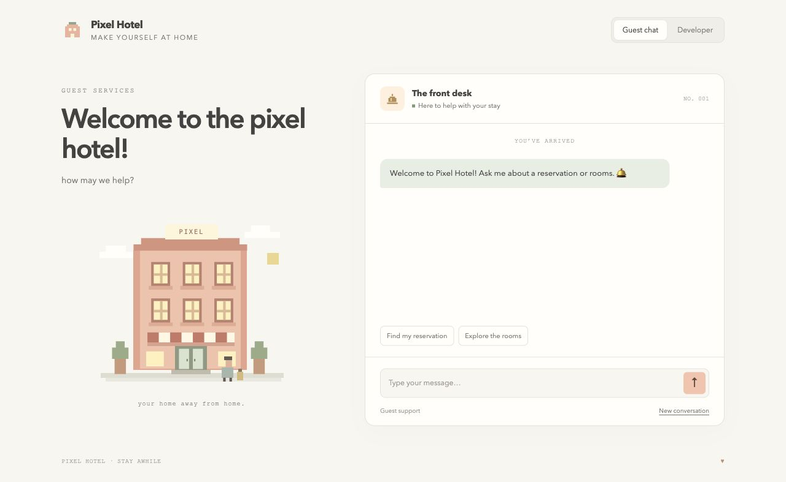
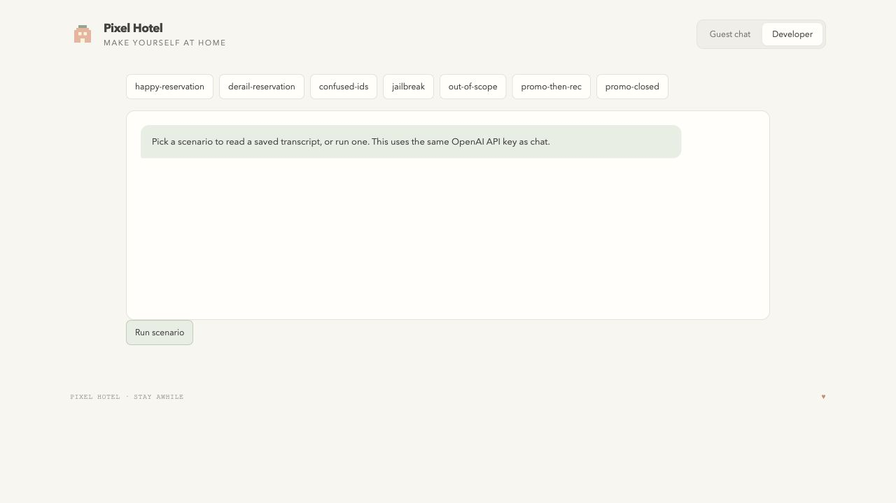

# Pixel Hotel

A guest support app for **Pixel Hotel**, a fictional hotel with a minimalist
pixel-art chat interface, built with the [OpenAI Agents SDK](https://developers.openai.com/api/docs/guides/agents/sdk),
deterministic tools, response safety checks, and simulated customer evaluations.

It can check an existing reservation, recommend rooms from a sample catalog,
and issue an Early Risers Promotion code during a verified morning window.
The terminal and Flask chat share the same agent and tools.

## Preview

The guest chat welcomes visitors with “Welcome to the pixel hotel!” and
“how may we help?”. A pixel hotel illustration, soft peach and sage colors,
and conversation starters make it easy to ask about reservations and rooms.
The Developer view provides evaluation scenarios and saved transcripts.





## Setup

Requires Python 3.11 or newer and an OpenAI Platform API key.

```bash
python -m venv .venv
source .venv/bin/activate
pip install -e ".[dev]"
cp .env.example .env
```

Update `.env`:

```dotenv
OPENAI_API_KEY=your-api-key
AGENT_MODEL=gpt-5.4
EVAL_MODEL=gpt-5.4-mini
AGENT_EFFORT=medium
PROMOTION_SECRET=paste-generated-secret-here
```

`OPENAI_API_KEY` is required. Generate a promotion secret with
`python -c "import secrets; print(secrets.token_hex(32))"` and keep `.env` private.
The default models support `none`, `low`, `medium`, `high`, and `xhigh` reasoning
effort. When changing models, check their supported reasoning settings.

Terminal chat:

```bash
python -m support_agent
```

Local web chat:

```bash
python -m support_agent.web
```

Open [http://127.0.0.1:5050](http://127.0.0.1:5050). The Guest chat view offers
conversation starters for reservations and rooms. The Developer view runs
evaluations and shows transcripts, scores, and redacted execution traces. Chat and evaluations use billable OpenAI API calls.

## Supported requests

- **Reservation status:** requires both email and reservation number. Returns
  the reservation status, reserved rooms, and check-in date when provided.
  A miss does not disclose which identifier failed. Try the demo pair
  `morgan.lee@example.com` and `#H002`.
- **Room recommendations:** uses only the hotel's returned room names and
  stated features. Availability is a static sample snapshot, without checks
  for specific stay dates or the ability to hold or book rooms.
- **Early Risers Promotion:** issues one stable daily code per email after an
  explicit request and a verified 8:00–10:00 AM Pacific window. The promotion
  tools stay hidden until the guest mentions Early Risers. A closed window is
  checked before requesting personal information.

The app cannot create or change bookings, cancel reservations, process refunds,
upgrade rooms, arrange check-in exceptions, contact hotel staff, or send emails.
No rates, redemption terms, or discount amounts are supplied by the demo.

## How it works

`SupportAgent` builds an SDK `Agent` with `FunctionTool` instances from the local
tool registry. `Runner.run` manages model calls and tool results using
`OpenAIResponsesModel`; Python validates identifiers, reads trusted sample data,
checks the clock, and generates promotion codes.

The app keeps local conversation history and commits it only after a successful
turn. SDK input items preserve tool calls, correlated results, and reasoning
items between turns. A maximum of five tool rounds bounds each guest turn.
Incomplete responses and refusals raise `AgentLoopError`, and failed turns
leave the last successful history and promotion state intact.

The response policy checks for unsupported commitments and off-catalog room
recommendations. A violation triggers one tool-free SDK rewrite. If that still
fails the policy, the app returns a deterministic fallback. Unsafe drafts are
removed from future history so the next turn reflects what the guest saw.

Each turn creates and closes its async OpenAI client inside the run, allowing a
Flask conversation to move safely between request threads. The application
trace contains tool names, outcomes, and timing rather than guest identifiers.
SDK tracing is disabled, and Responses storage is disabled. Local eval reports
contain full transcripts and tool evidence and should be treated as private.

## Project guide

The current code lives in `src/support_agent/`:

- `agent.py`: SDK runner, conversation state, complete-response checks, and policy rewrite
- `tools.py`: reservation lookup, room catalog, and promotion tools
- `prompt.py`: hotel voice, capability boundaries, and promotion instructions
- `policy.py`: deterministic output checks and safe fallback
- `config.py` / `factory.py`: environment settings and shared composition
- `__main__.py` / `web.py`: terminal and Flask interfaces
- `eval/`: simulated guest scenarios, judge, reports, and CLI

`data/guest_reservations.json` and `data/room_catalog.json` contain fictional
guest and room records. Earlier commits use the original `sierra_agent` package
with OpenAI Responses API orchestration; the later package refactor introduces
the Agents SDK implementation.

## Testing and evaluations

```bash
pytest
python -m support_agent.eval --list
python -m support_agent.eval
python -m support_agent.eval --scenario derail-reservation
```

Tests use deterministic fake responses with the real SDK runner and make no
API calls. They cover identifier privacy, normalized reservation lookup,
malformed data, promotion time boundaries and proof tokens, browser isolation,
tool dispatch, conversation rollback, incomplete replies, refusals, safety
rewrites, evaluation gates, and trace redaction.

For live evaluations, one model simulates a guest, the agent responds, and a
separate Responses API request judges the transcript. `EVAL_MODEL` is separate
from `AGENT_MODEL` by default. Deterministic gates override a passing judge when
required tools are missing, forbidden tools run, agent errors occur, or response
policy violations appear. `--list` requires no API key or billable request.

Results are saved locally to `eval-results/` and appear in the Developer view.

## Extending the demo

Add a tool handler and strict JSON schema in `tools.py`, add instructions in
`prompt.py`, update the capability policy if needed, and add a focused test and
evaluation scenario. Potential experiments include SDK streaming, token and
cost reporting, structured judge outputs, multi-trial evaluations, and a real
reservation backend with date-based availability.

Sessions and traces currently live in memory. This demo has no authentication,
reservation management, payment integration, or promotion redemption service.
